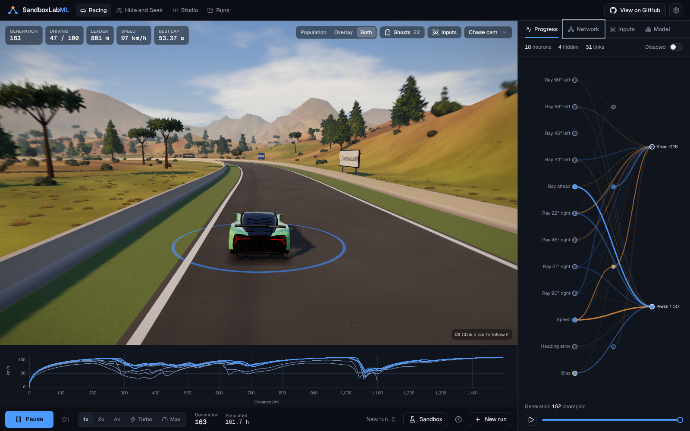
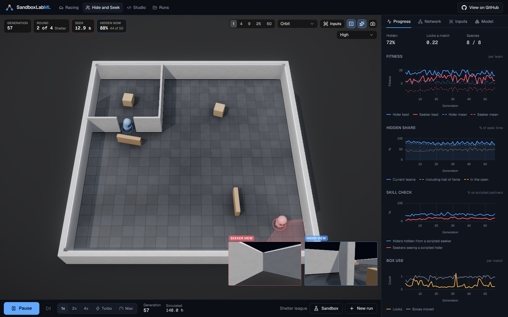
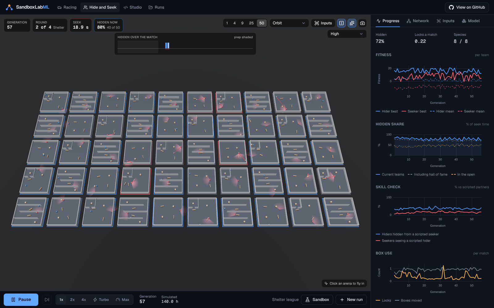
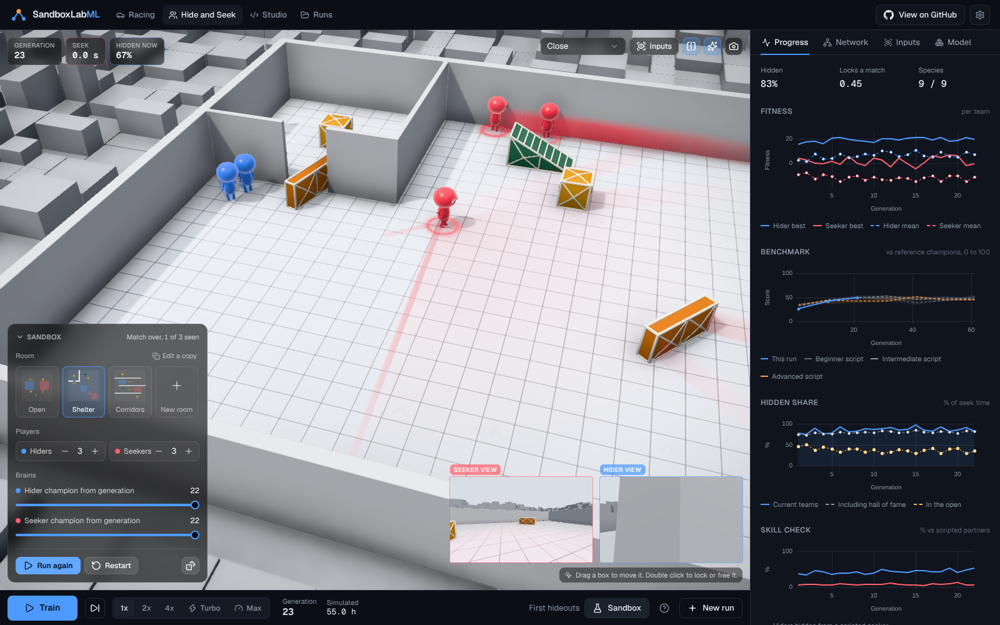
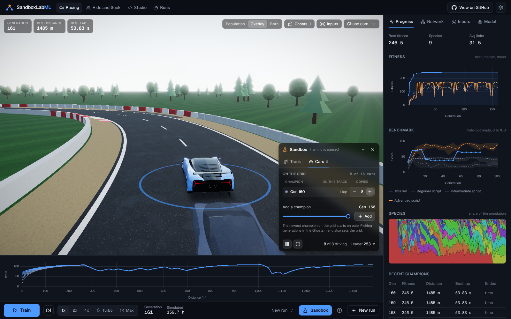
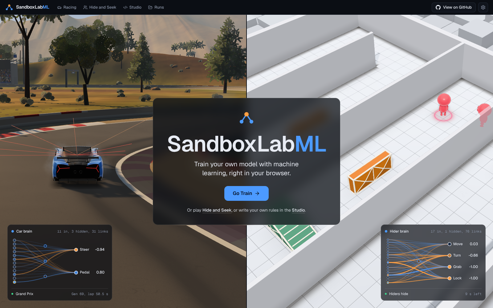
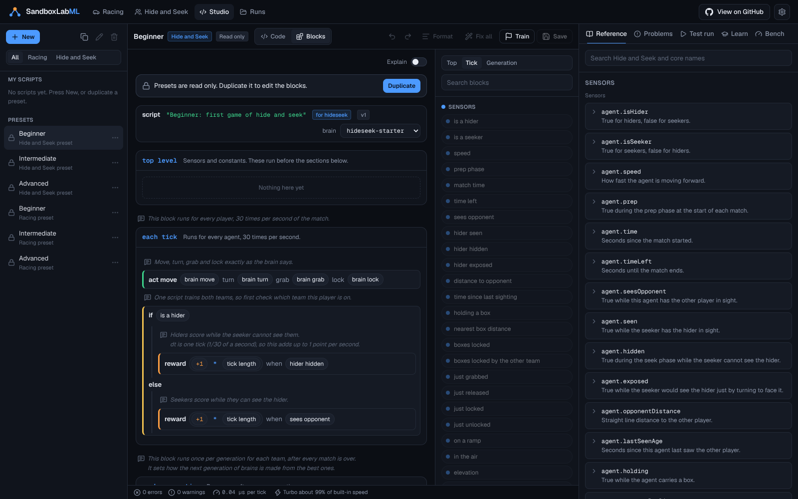

<p align="center">
  
</p>

<h1 align="center">SandboxLabML</h1>

<p align="center">A live machine learning lab in your browser, where you watch neural networks learn to race and play hide and seek in 3D.</p>

<p align="center">
  <a href="LICENSE"></a>
  
  
</p>

## What it is

SandboxLabML lets you see machine learning happen. Press Train and a population of neural networks starts learning right in front of you. Cars find the racing line and learn where to brake. Hiders grab crates for cover and lock them in place. Seekers can push a ramp against a wall and jump right over it.

None of it is a canned animation. Every car and every agent is driven by a real network that evolved seconds ago, inside a real physics simulation, on your own machine. Open any brain and its neurons light up as it decides. Change the rewards, the inputs or the brain itself, and the next generation shows you what that change did. Even the landing page plays real brains: a trained car laps the Grand Prix and reference champions play hide and seek behind the title.

This is the loop that makes machine learning click. You shape the goal and press Train, then watch behavior appear that nobody programmed.

## Screenshots



| | |
| --- | --- |
|  |  |
|  |  |
|  |  |

## What you can do

### Train cars to race

A hundred hypercars learn to drive a 3D circuit from nothing. The tires have a real grip limit, so braking and turning fight over the same grip and the cars have to discover braking points on their own. Ghosts of earlier champions drive beside the live generation. A speed trace and a brake map show the braking points move later as they learn.

### Train hiders and seekers

Two teams co-evolve in a physics arena. Agents grab crates, carry them and lock them for their team, and a lock only opens for the team that made it. Ramps let an agent run up and vault a wall, so a fort is only safe if the seekers cannot get a ramp to it. Watch all 50 matches of a round at once, then click one to follow it up close with a first person view of what each agent sees.

### Play with what you trained

Every trained model can leave training and go into the Sandbox. In Racing, pick a track from the gallery or draw your own, then line up a field of up to 16 champions. In Hide and Seek, choose a room or build one on a grid with walls, crates and ramps, then spawn up to eight hiders and eight seekers and let them play.

### Write the training loop yourself

Training is driven by a small, safe script language called SBL. Edit it as blocks or as code, since both views edit the same script. It comes with docs, autocorrect and a test run that plays one episode tick by tick. Thirteen guided lessons across both games teach it step by step beside a live preview.

### Tune everything

Population size, brain shape, sensors, sensor noise, rewards and training speed are all yours to set. Settings in the top right pick the frame rate (30, 60 or Max) and the quality (Low, Medium or High). Drag the divider between the 3D view and the panel to give either side more room.

## Why you can trust what you see

* **Real neuroevolution.** Brains evolve with NEAT, which starts from tiny networks and grows them. Mutations add links and neurons, and speciation protects new ideas long enough to improve.
* **Real physics.** Racing uses a tire model with a grip limit. Hide and Seek runs on the Rapier physics engine, so crates are pushed and blocked by real contacts.
* **Fully reproducible.** Every random number is seeded and every weight is stored exactly. Replays are re-simulated from stored brains instead of recorded video, and a test checks a replay matches its training run tick for tick.
* **Benchmarked.** A built-in benchmark scores any model on held-out tracks or against fixed reference champions, so you can tell real learning from overfitting.
* **Private by default.** Everything runs locally in Web Workers. Runs are saved in your browser and can be exported as a file to share.

## How it works

* **Simulate lean, render rich.** Racing simulates in 2D at 30 Hz with a kinematic bicycle model. Hide and Seek simulates with Rapier. The renderer only reads snapshots and interpolates them, so quality settings never change a training result.
* **Threads.** A coordinator worker runs evolution, sim workers run episodes on every spare core, and a replay worker drives ghosts and the Sandbox. Snapshots stream to the renderer as transferable buffers.
* **Live networks.** The network graph draws every neuron and link of the current champion and lights them with real activations each tick. A model card tracks parameters and size as the brain grows.
* **Scripts are data.** SBL is parsed, checked against an API registry (names, units and scopes) and compiled into closure trees. Nothing ever evaluates generated JavaScript, so an imported run cannot carry code that runs on open.

More detail lives in [docs/architecture.md](docs/architecture.md) and [docs/benchmark.md](docs/benchmark.md).

## Getting started

You need Node.js 20.9 or newer (22 is what CI uses).

```bash
git clone https://github.com/edison16a/SandboxLabML.git
cd SandboxLabML
npm install
npm run dev
```

Open http://localhost:3000. To try the production build locally:

```bash
npm run build
npm start
```

### Deploy to Vercel

The app is a standard Next.js project with no server code or environment variables. Import the repository in Vercel, keep the detected Next.js settings, and deploy.

## Development

| Command | What it does |
| --- | --- |
| `npm run dev` | Development server with hot reload |
| `npm run lint` | ESLint |
| `npm run typecheck` | TypeScript, strict |
| `npm test` | Vitest unit tests for the engine, storage and logic |
| `npm run e2e` | Playwright browser tests (run `npm run build` first) |
| `npm run refs` | Regenerates the benchmark reference results |
| `npm run icons` | Re-renders the PNG app icons from the SVG |
| `npm run hero:car` | Trains the car the landing page shows driving |
| `npm run hero:poster` | Captures the landing page poster from the live scene (needs a running build) |

### Project layout

```
app/               Next.js routes (landing, labs, Studio, Runs)
src/engine/        Pure TypeScript: NEAT, Racing, Hide and Seek, SBL, benchmarks, lessons
src/workers/       Coordinator, sim and replay workers, plus the main thread client
src/render/        React Three Fiber scenes and shared render helpers
src/features/      Lab pages, Sandboxes, charts, network graph, model card, runs, landing
src/studio/        Script Studio
src/storage/       IndexedDB (Dexie): runs, generations, checkpoints, scripts, tracks, rooms
src/ui/            Design system on Radix primitives, logo and GitHub button
content/lessons/   Lesson content
public/references/ Benchmark reference results
public/hero/       The landing page's trained car and its poster stills
```

### Stack

Next.js 16, React 19, TypeScript, Tailwind CSS 4, three.js with React Three Fiber, drei and postprocessing, Rapier, Comlink, Zustand, Dexie, uPlot, CodeMirror 6, Vitest and Playwright.

## License

MIT, see [LICENSE](LICENSE).
