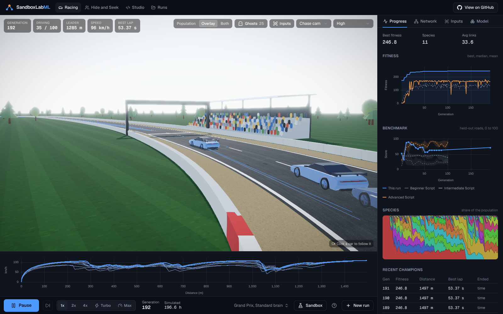
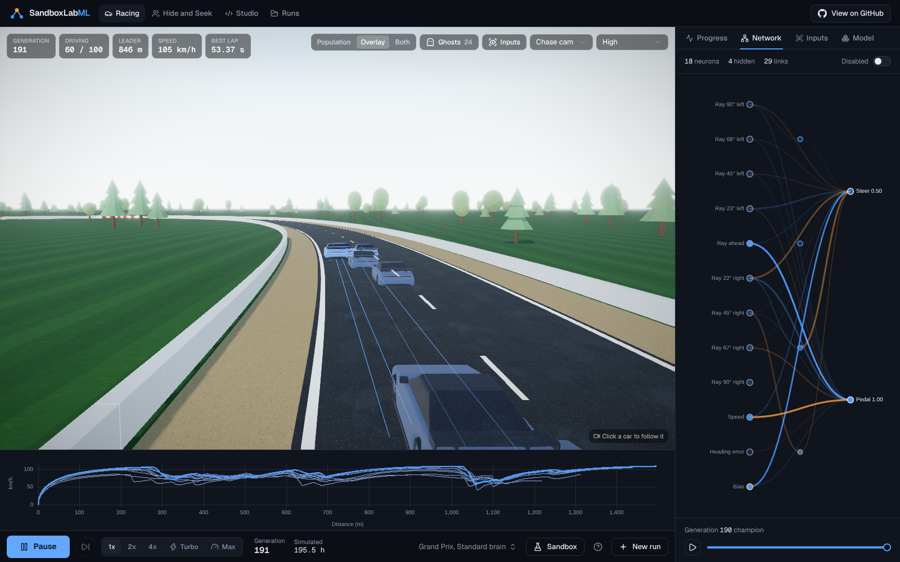
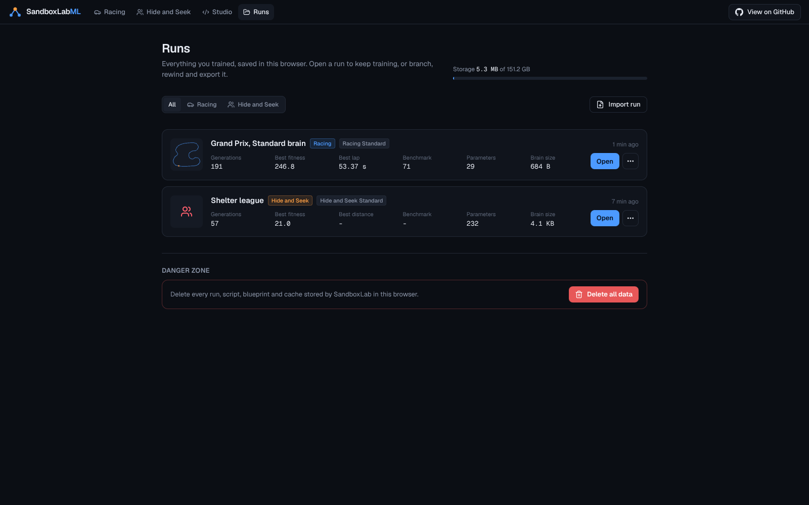

<p align="center">
  
</p>

<h1 align="center">SandboxLabML</h1>

<p align="center">Watch neural networks evolve to race cars and play hide and seek in 3D, then write the training loop yourself, all in your browser.</p>

<p align="center">
  <a href="LICENSE"></a>
  
  
</p>

## Screenshots


| | |
| --- | --- |
|  |  |
|  |  |
|  |  |

## What it is

SandboxLabML is a hands-on lab for learning how machine learning actually behaves. Populations of small neural networks evolve with NEAT (NeuroEvolution of Augmenting Topologies) while you watch:

* **Racing.** A hundred cars learn to drive a 3D circuit. The car model has a real grip limit, so braking and turning compete for the same tires and the cars have to discover braking points on their own. Ghosts of earlier champions drive alongside the live generation, with a speed trace and a brake map that show braking points moving later as they learn.
* **Hide and Seek.** Hiders and seekers co-evolve in a physics arena with boxes they can grab and lock. Watch all 50 matches of a round at once, then click one to see it in a high quality showcase view, including what each agent sees.
* **Script Studio.** The training loop is a small, safe language (SBL) that you can edit as blocks or as code. Both views edit one script, with docs, autocorrect and a test run built in. Guided lessons build a script step by step, and a benchmark scores any model against reference runs.

Everything runs locally. Training happens in Web Workers, runs are saved in your browser, and a run can be exported as a file to share.

## How it works

* **NEAT** starts from tiny networks and grows them: mutations add links and neurons, crossover lines genomes up by innovation number, and speciation protects new ideas long enough to improve. The network graph shows every neuron firing live, and a model card tracks parameters and size as the brain grows.
* **Simulate lean, render rich.** Racing simulates in 2D at 30 Hz with a kinematic bicycle model; Hide and Seek simulates with Rapier physics. The renderer only reads snapshots and interpolates them at 60 Hz, so quality settings never change a training result.
* **Determinism.** Every random number is seeded, weights are stored exactly, and cars never share state. That is what lets ghosts be re-simulated from stored genomes instead of recorded video, and a test checks a replay matches its training run tick for tick.
* **Threads.** A coordinator worker runs evolution, sim workers run episodes on every spare core, and a replay worker drives ghosts and the Sandbox. Snapshots stream to the renderer as transferable buffers.
* **Scripts are data.** SBL is parsed, checked against an API registry (names, units and scopes) and compiled into closure trees. Nothing ever evaluates generated JavaScript, so an imported run cannot carry code that runs on open.

More detail lives in [docs/architecture.md](docs/architecture.md) and [docs/benchmark.md](docs/benchmark.md).

## Getting started

You need Node.js 20.9 or newer (22 is what CI uses).

```bash
git clone https://github.com/edison16a/SandboxLabML.git
cd SandboxLabML
npm install
npm run dev
```

Open http://localhost:3000. To try the production build locally:

```bash
npm run build
npm start
```

### Deploy to Vercel

The app is a standard Next.js project with no server code or environment variables. Import the repository in Vercel, keep the detected Next.js settings, and deploy.

## Development

| Command | What it does |
| --- | --- |
| `npm run dev` | Development server with hot reload |
| `npm run lint` | ESLint |
| `npm run typecheck` | TypeScript, strict |
| `npm test` | Vitest unit tests for the engine, storage and logic |
| `npm run e2e` | Playwright browser tests (builds must exist; run `npm run build` first) |
| `npm run refs` | Regenerates the benchmark reference results |
| `npm run icons` | Re-renders the PNG app icons from the SVG |

### Project layout

```
app/               Next.js routes (landing, labs, Studio, Runs)
src/engine/        Pure TypeScript: NEAT, Racing, Hide and Seek, SBL, benchmarks, lessons
src/workers/       Coordinator, sim and replay workers, plus the main-thread client
src/render/        React Three Fiber scenes, shared render helpers
src/features/      Lab pages, charts, network graph, model card, runs, landing
src/studio/        Script Studio
src/storage/       IndexedDB (Dexie): runs, generations, checkpoints, scripts
src/ui/            Design system on Radix primitives, logo and GitHub button
content/lessons/   Lesson content
public/references/ Benchmark reference results
```

### Stack

Next.js 16, React 19, TypeScript, Tailwind CSS 4, three.js with React Three Fiber, drei and postprocessing, Rapier, Comlink, Zustand, Dexie, uPlot, CodeMirror 6, Vitest and Playwright.

## License

MIT, see [LICENSE](LICENSE).
